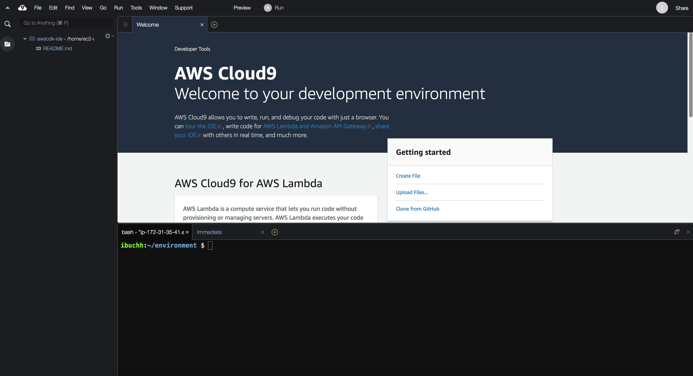

## Build and Deploy a Contact Tracing Solution with AWS IoT Core & SafeTrack Lite

[](https://travis-ci.org/joemccann/dillinger)
[](https://gitpod.io/#https://github.com/aws/aws-cdk)
[](https://badge.fury.io/js/aws-cdk)
[](https://badge.fury.io/py/aws-cdk.core)
[](https://badge.fury.io/nu/Amazon.CDK)

### Architecture


### Walkthrough

The architecture includes the following steps:

- The SafeTrack wearable is used out in the field collecting various interactions with other SafeTrack devices.
- When the SafeTrack wearable is within X feet of a LoRaWAN gateway, it will join the gateway.
- The LoRaWAN gateway’s network server will forward the wearable data to AWS IoT Core
- AWS IoT Core’s Rules Engine will trigger the Lambda function to decode the message and create a record in DynamoDB.
- AWS API Gateway enables frontend applications (i.e.: SafeTrack Lite) to retrieve the device data and create a report of all the contact tracing data.

### Prerequisites

To get started, you will need to have the following prerequisites:

- An AWS account
  - Permission to access AWS IoT Core, Lambda, and DynamoDB
- CareBand’s SafeTrack Demo Kit
- A LoRaWAN gateway (any gateway that operates on the US915 band)
  - Helium (sign up for access to Helium Console)
- A SafeTrack Lite account

### Stack

The stack consists of:

- A DynamoDB Table: `safetrack-data`
- Two Lambda functions: `safeTrackApiFunction`, `safeTrackDataFunction`
- An HTTP API: `order-safetrack-lite-integration`
- An API gateway

### Steps

- Setup AWS account [profile](https://docs.aws.amazon.com/cli/latest/userguide/cli-configure-quickstart.html#cli-configure-quickstart-config) or create an [AWS Cloud9](https://docs.aws.amazon.com/cloud9/latest/user-guide/create-environment-main.html) environment. Cloud9 will provide you terminal access to run AWS CLI. Click on "Create Environment". Provide any environment name and accept the rest of the default parameters.



- Install AWS CDK
  First create the AWS CDK Toolkit. The toolkit is a command-line utility which allows you to work with CDK apps.

      ```bash
       npm install -g aws-cdk
      ```

- Upgrade AWS CDK

  ```bash
   npm upgrade -g aws-cdk
  ```

- Create a CDK project

  ```bash
  mkdir aws-cdk-careband-iot
  cd aws-cdk-careband-iot
  cdk init app -l typescript
  ```

- Copy the AWS Lambda functions into the `src` folder
- Open `lib/aws-cdk-careband-iot-stack.ts` file using an editor
- Create a DynamoDB Table

```ts
// safetrack-data Table

const tableName = "safetrack-data";

const dynamoDBTable = new Table(this, "SafeTrackDataTable", {
  tableName,
  partitionKey: { name: "dev_eui", type: AttributeType.STRING },
  sortKey: { name: "server_time", type: AttributeType.STRING },
  removalPolicy: RemovalPolicy.DESTROY,
});
```

- Create two Lambda functions

```ts
// SafeTrackApiFunction

const safeTrackApiLambda = new LambdaFunction(this, "SafeTrackApiFunction", {
  code: Code.fromAsset("./src"),
  functionName: "safeTrackApiFunction",
  handler: "app.handler",
  runtime: Runtime.NODEJS_12_X,
});

// SafeTrackDataFunction

const safeTrackDataLmabda = new LambdaFunction(this, "SafeTrackDataFunction", {
  code: Code.fromAsset("./src"),
  functionName: "safeTrackDataFunction",
  handler: "data.handler",
  runtime: Runtime.NODEJS_12_X,
});
```

- Create a Lambda Proxy Integration

```ts
// SafeTrackApiProxyIntegration

const safeTrackApiLambdaProxyIntegration = new LambdaProxyIntegration({
  handler: safeTrackApiLambda,
});
```

- Create an HTTP Api

```ts
// SafeTrackHttpApi

const orderSafeTrackHttpApi = new HttpApi(this, "OrderSafeTrackHttpApi", {
  apiName: "order-safetrack-lite-integration",
  hanndler: safeTrackApiLambda,
});
```

- Create an HTTP Api Route

```ts
// SafeTrackHttpApi Route

orderSafeTrackHttpApi.addRoutes({
  integration: safeTrackApiLambdaProxyIntegration,
  methods: [HttpMethod.ANY],
  path: "/",
});
```

- Grant ReadWrite access to DynamoDB Table

```ts
//Grant ReadWrite access of DynamoDB Table to Lambda Functions

dynamoDBTable.grantReadWriteData(safeTrackApiLambda);
dynamoDBTable.grantReadWriteData(safeTrackDataLmabda);
```

- Bootstrap an environment

```bash
 npm install
 npm run build
 cdk bootstrap
```

- Deploy the stack

```bash
 cdk synth
 cdk deploy
```
