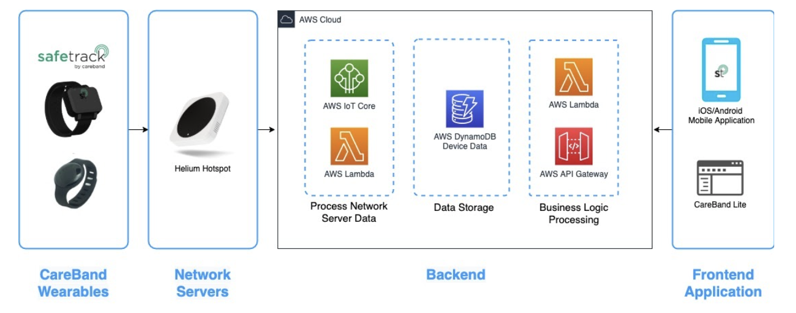

## Build and Deploy a Contact Tracing Solution with AWS IoT Core & SafeTrack Lite


### Architecture



### Walkthrough

The architecture includes the following steps:

* The SafeTrack wearable is used out in the field collecting various interactions with other SafeTrack devices.
* When the SafeTrack wearable is within X feet of a LoRaWAN gateway, it will join the gateway.
* The LoRaWAN gateway’s network server will forward the wearable data to AWS IoT Core
* AWS IoT Core’s Rules Engine will trigger the Lambda function to decode the message and create a record in DynamoDB.
* AWS API Gateway enables frontend applications (i.e.: SafeTrack Lite) to retrieve the device data and create a report of all the contact tracing data.

### Prerequisites

To get started, you will need to have the following prerequisites: 
* An AWS account

    * Permission to access AWS IoT Core, Lambda, and DynamoDB
* CareBand’s SafeTrack Demo Kit
* A LoRaWAN gateway (any gateway that operates on the US915 band)
    * Helium (sign up for access to Helium Console)
* A SafeTrack Lite account


### Stack

The stack consists of:

* A DynamoDB Table: `safetrack-data`
* Two Lambda functions: `safeTrackApiFunction`, `safeTrackDataFunction`
* An HTTP API: `order-safetrack-lite-integration`
* An API gateway

### Steps
* Setup AWS account [profile](https://docs.aws.amazon.com/cli/latest/userguide/cli-configure-quickstart.html#cli-configure-quickstart-config) or create an [AWS Cloud9](https://docs.aws.amazon.com/cloud9/latest/user-guide/create-environment-main.html) environment.
* Install Node.js as explained [here](https://nodejs.org/en/download/package-manager/)
* Install AWS CDK

    `npm install -g aws-cdk`

* Upgrade AWS CDK

    `npm upgrade -g aws-cdk`

* Create a CDK project
    ```
    mkdir aws-cdk-caraeband-iot
    cd aws-cdk-caraeband-iot
    cdk init app -l typescript
    ```

* Open `lib/aws-cdk-caraeband-iot-stack.ts` file using an editor
* Create a DynamoDB Table
```
    // safetrack-data Table

    const tableName = 'safetrack-data';

    const dynamoDBTable = new Table(this, 'SafeTrackDataTable', {
      tableName,
      partitionKey: { name: 'dev_eui', type: AttributeType.STRING },
      sortKey: { name: 'server_time', type: AttributeType.STRING },
      removalPolicy: RemovalPolicy.DESTROY,
    });
```
* Create two Lambda functions
```
    // SafeTrackApiFunction

    const safeTrackApiLambda = new LambdaFunction(this, 'SafeTrackApiFunction', {
      code: Code.fromAsset('./src'),
      functionName: 'safeTrackApiFunction',
      handler: 'app.handler',
      runtime: Runtime.NODEJS_12_X,
    });

    // SafeTrackDataFunction

    const safeTrackDataLmabda = new LambdaFunction(this, 'SafeTrackDataFunction', {
      code: Code.fromAsset('./src'),
      functionName: 'safeTrackDataFunction',
      handler: 'data.handler',
      runtime: Runtime.NODEJS_12_X,
    });
```
* Create a Lambda Proxy Integration
```
    // SafeTrackApiProxyIntegration

    const safeTrackApiLambdaProxyIntegration = new LambdaProxyIntegration({
      handler: safeTrackApiLambda,
    });
```
* Create an HTTP Api
```
    // SafeTrackHttpApi

    const orderSafeTrackHttpApi = new HttpApi(this, 'OrderSafeTrackHttpApi', {
      apiName: 'order-safetrack-lite-integration',
    });ndler: safeTrackApiLambda,
    });
```
* Create an HTTP Api Route
```
    // SafeTrackHttpApi Route

    orderSafeTrackHttpApi.addRoutes({
      integration: safeTrackApiLambdaProxyIntegration,
      methods: [HttpMethod.ANY],
      path: '/',
    });
```
* Grant ReadWrite access to DynamoDB Table
```
    //Grant ReadWrite access of DynamoDB Table to Lambda Functions

    dynamoDBTable.grantReadWriteData(safeTrackApiLambda);

    dynamoDBTable.grantReadWriteData(safeTrackDataLmabda);
```
* Bootstrap an environment
```
npm install
npm run build
cdk bootstrap
```

* Deploy the stack
```
cdk synth
cdk deploy
```

